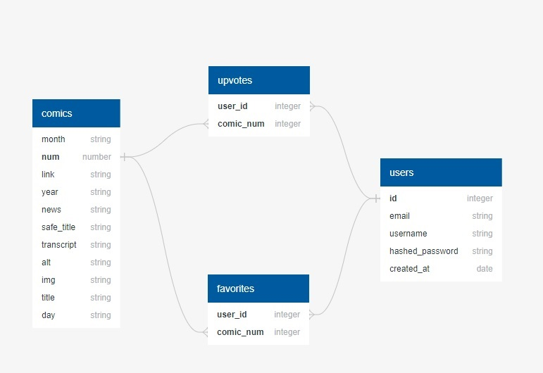

## December 4, 2022, 3:30 PM

My first step needs to be to populate my database. The first thing that I need to do is create the sql database that I will use, which I will name "xkcd". I will then create a table called "comics", but in order to successfully populate it, I need to know the full range of possible keys that come back in the JSON. This means that I need to scrape all possible endpoints to create a JSON object that I can analyze.

Next, I need to write a node script which uses axios and includes the following:
- A function that sends a get request to a given endpoint
- A function that writes the results of a request to a JSON file
- A function that implements the prior two functions to populate the JSON file

Once this is done, I will take a closer look at the JSON to create my schema for the "comics" table.

## December 9, 2022, 9:10 AM

I've downloaded all of the comic metadata from #1 up to comic #2707. First of all, I've found that I have all of the comics except for #404, which does not exist (even on the xkcd site, comic 404 is just their 404 page). Playing around with the data a bit further, I've found that all responses have the following schema:

"month" string 
"num" number 
"link" string 
"year" string 
"news" string 
"safe_title" string 
"transcript" string 
"alt" string 
"img" string 
"title" string 
"day" string 

The only outlier is that there are twenty comics which have an "extra_parts" key, which contains some object. These mostly seem to contain script elements that are meant to be used on the comic (making certain parts clickable, a comic with a table of .gif images that allows for a basic animation). Not all extra_parts objects have the same keys, but they all have one or more of the following: 'pre', 'headerextra', 'post', 'imgAttr', 'inset', 'links'.

These seem to be basic scripts that I can simply drop in when showing the images myself, but I won't cross that bridge for a while. In the meantime, there are so few of these (and in something of a messy pattern) that I will not include them as part of my main comics table. They may go into another SQL table, or I may store them somewhere else, or I may avoid them altogether if it proves that it is too complicated to represent these when there are other things that need to be done. These special cases are only 20 out of over 2,700 comics.

Meanwhile, it seems like I can begin putting together my comics table clearly from the JSON that I'm getting back.

## December 9, 2022, 1:40 PM

My visualized database should look like this:

I now need to review express-jobly and perhaps other projects to see how to corretly model and seed this with pg and sql.

## December 10, 2022, 12:55 PM

Though I have some cleanup to do, I have set up my config.js file, my db.js file, and my seed.js file to seed my test database. My next step will be to set up my models with the following methods

Comic
-getComic
-addComic

User
-getUser
-signup
-authenticate
-editUser

Upvote
-addUpvote
-removeUpvote

Favorite
-addFavorite
-removeFavorite

## December 10, 2022, 3:00 PM

I've completed Comic.js for now, as well as Comic.test.js with all tests passing. There may be more changes I make to these later, but otherwise I will go ahead with the remaining models, writing tests as I go.

## December 10, 2022, 4:00 PM

I've added some errors while working on User, and I will also need to use those errors for some cases in Comic.js and Comic.test.js that are currently only returning strings for not being found. This will give me a more straightforward way of handling errors when it comes time to handle the actual routing. Additionally, I am using uuid to generate user ids, which means I need to change my User schema so that ids are held as text instead of as integers. This means I will also need to correct my upvotes and favorites tables to reflect that the foreign key in users is text and not an integer.

## December 11, 2022, 10:15 AM

I realized that I needed to make another correction to my database setup, which is to make 'username' UNIQUE on the users table. This means that a user will now have three unique identifiers, although username and email may be subject to change.

## December 11, 2022, 1:05 PM

Made additional changes to Comic.js and Comic.test.js to better handle errors and to catch them in the test where I was not accurately doing so before.

## December 11, 2022, 5:15 PM

I had a great deal of difficulty getting User.signup working, but it appears to finally be working correctly. I need to be more careful with my db queries, because bad arguments throw errors that don't provide a tremendous amount of detail. I also learned that I should change my created_at in users from a DATE to a TIMESTAMPTZ, which I can populate by using NOW() in the db query string (not the array).

## December 11, 2022, 6:20 PM

I still have the favorites and upvotes models to do, but I want to move ahead slightly and take care of the basic scaffolding for the backend so that I can start serving some of the comics. I may also need to add a more detailed version of getComic to Comic.js which will return upvotes and favorites along with the data from the comics table.

## December 11, 2022, 8:30 PM

In order to fill in some of the scaffolding, I need to write my middleware auth token. I am expecting the auth token to simply be in req.headers.token, and I will not require it to be preceded by "Bearer" or any other decorator. If jwt successfully verifies a token, the user id will go to req.user_id. req.user_id will be set to null before making this check, so as to prevent a request from being manipulated to give it a user_id separately from the jwt verification process.

## December 12, 2022, 7:20 PM

I've added a very basic express router for "/comics" which has a "/:num" route which is now serving from my (test) database. It successfully passes a Not Found error message if the parameter is invalid and successfully passes the correct json with a valid comic number. In one small degree, I have what looks like full end-to-end capability (not tested yet) on one point. I don't have time to do much more this evening, but I expect that my next step will be to return to my database models to get them fully operational before continuing on with routing, authorization, tokens, etc.

## December 16, 2022, 4:00 PM

I am returning to this after several days away to work on behavioral interview prep. I need to build my Upvote.js and Favorite.js files, which I expect will be virtually identical to one another since they are essentially just two different tables to show the same feature (the difference will be meaningful on the front-end). As of now, I don't know if I'll put get methods on upvotes/favorites or put those methods on the Comic and User models.

## December 23, 2022, 2:50 PM

I've returned to this after several days off and realized that I needed to add several additional model methods. The main one that I needed to add is a more robust version of getComic, which also returns upvote and favorite data. However, because this makes requests on more models than just the Comic model, I wanted to create a new file in models that I am calling Controls.js to handle any database logic that does not fit neatly within a single model/table. However, I realized that I also needed to add getters for my Favorite and Upvote models. I added two for each: one that searches by comic_num and the other searches for user_id. The methods that search by comic_num have been incorporated into the Controls.js getComicDetails method, and the one that searches by user_id should be useful for a logged-in user when I get to the routing.

## December 27, 2022, 4:45 PM

I've moved over to building and testing routes, and while testing the auth route, I realized that supertest will leave the app open as I had it, with the app.listen line being in app.js. I decided to follow the example of express-jobly, and create a separate server.js file just to hold the app.listen line, so that I don't leave my route tests open as I run them.

## December 28, 2022, 12:00 PM

I've decided for the sake of simplicity to put all of my add/remove upvote/favorite routes onto my comics routes.

## December 30, 2022, 11:20 AM

I slightly modified some of my comics routes, so that now adding upvotes and favorites will be POSTs to "/comics/upvotes" etc., and deletions will be DELETE requests to the same address. This is now done and all tests are passing on these essential backend operations, though there is opportunity to add other features such as:

-edit a username, email, password
-add searchability for comic text

These can be implemented down the raod, however at this point I believe that it's prudent to switch to working on the frontend to get everything up and running as much as possible before adding any additional features. 

I want to keep everything in a single git repository, which means that I need to reorganize my file structure slightly to create just "backend" and "frontend" folders as the only folders in this directory with everything else flowing through there. I will also need to delete the default git repo that comes with create-react-app once I get to that point. Right now with all of my backend tests passing, I need to make a commit before tampering with my file structure. 

## December 30, 2022, 12:05 PM

Now that I have the front-end to work on, I need to consider how I want the front-end to look and work. Since the server is not rendering anything but is just an API, I need to handle routing and use the React Router. I need the following pages:

-Random comic (home)
-Login
-Signup
-View Comic (with upvote and favorite options if logged in, prompt to log in if not)
-Logout (redirect to home)
-Logged in user's upvotes (requires more backend work)
-Logged in user's favorites (requires more backend work)

As far as state, the most critical thing that I keep track of across all pages is the token, but I also need to keep track of the username and user email. 

I intend to make a Comic component which will include the buttons for upvoting and favoriting, though I am also realizing that I want to add controls (and will also require the backend functionality for) to do the following:

-Go to the next comic
-Go to the previous comic
-Go to a random comic

## December 31, 12:30 PM

I added a "prev" and "subsequent" to the Comic.getComic function using the LAG and LEAD commands in SQL and made sure that everything still worked well downstream.

## January 2, 10:00 AM

It seems that I may have been too hasty to jump into buidling components on the front end, when I have Context and the all-purpose Api issues to worry about first. I'm switching to building up my API class using React-Jobly as a guide. Once I have the basics up, I'll build the signup, login, and logout static methods, and build the login and logout components to make sure that this is working.

## January 2, 11:00 AM

I've realized that my backend is currently returning a token without announcing it (token) instead of {token}, and so the front end api methods that need to retrieve the token will have a difficult time actually determining if there is a token. As a result, I'm going to make modifications to my authRouter and its tests to return {token}. I also realized that the entire user object in this case is just the id, username, and password, and so I should be returning all of those things rather than just the id. This will save me from having to write a second request for user information after any successfull signup/login.